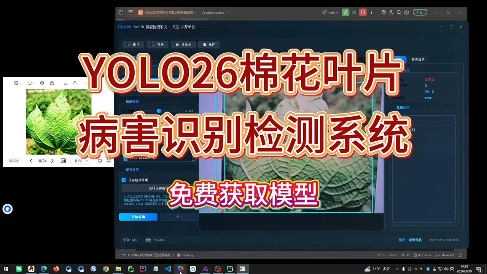
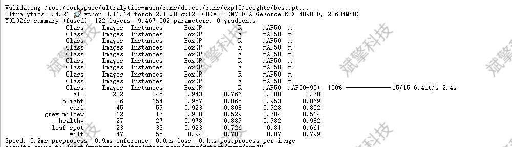
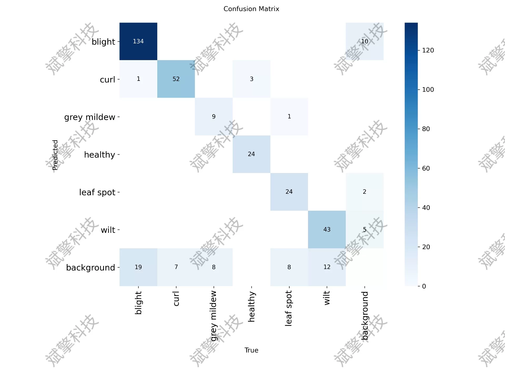
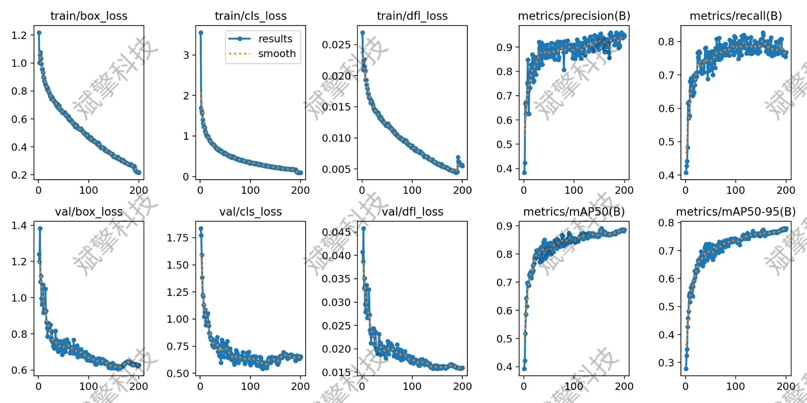
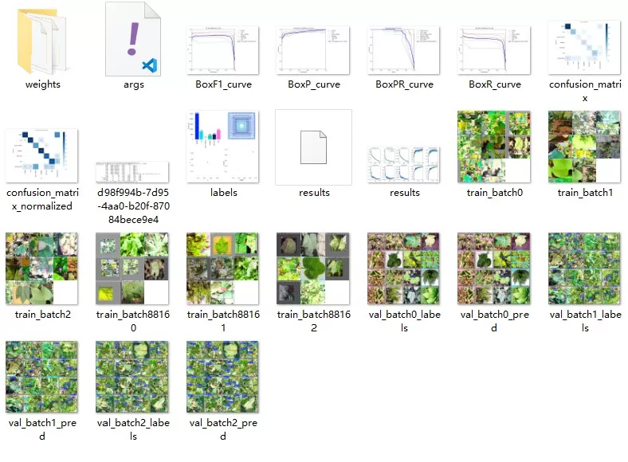
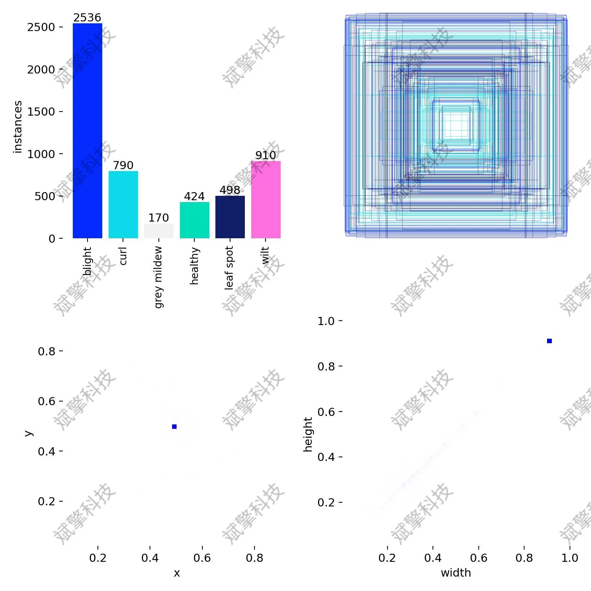
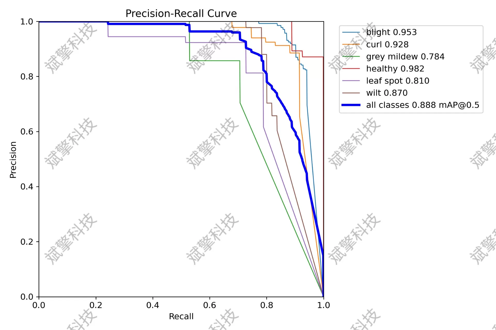
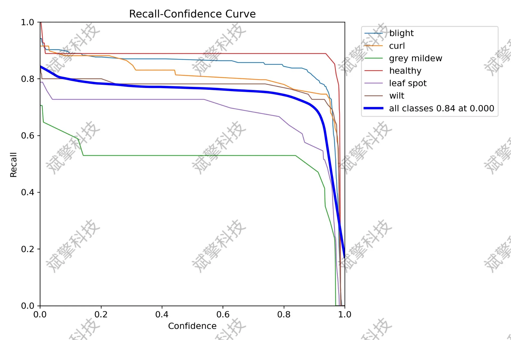
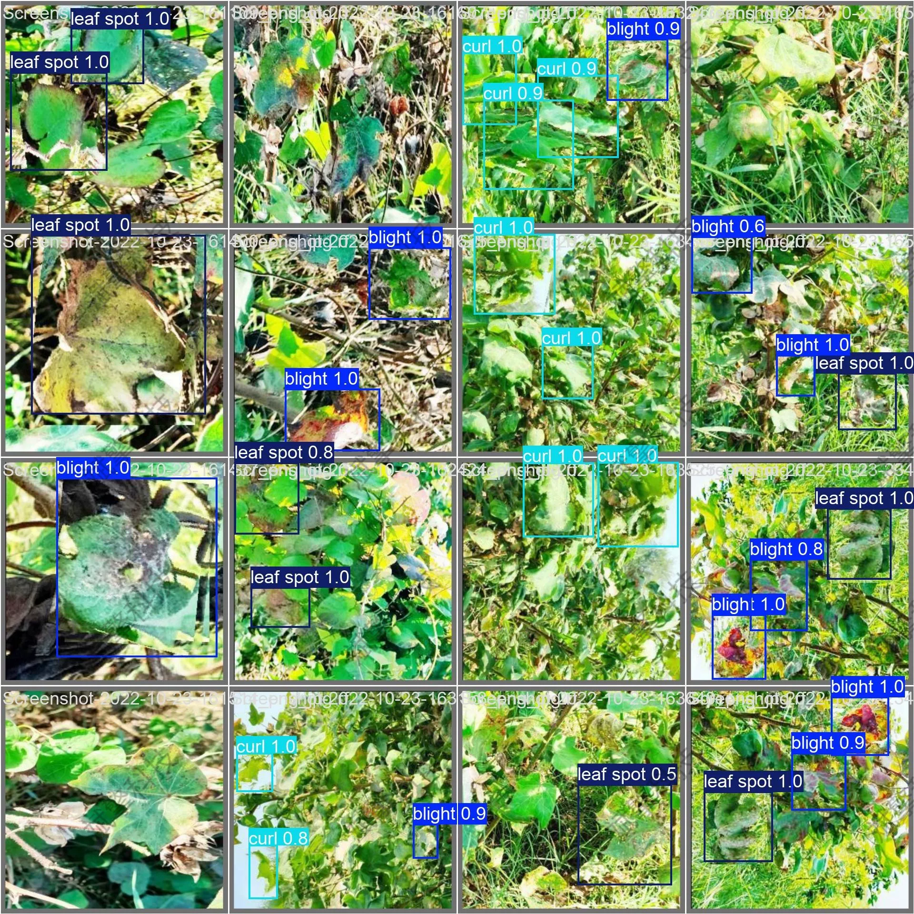

# YOLO26 cotton leaf disease identification system | source code

## Body

YOLO26 cotton leaf disease recognition system | Source code I wrote a "cotton doctor" with YOLO26, recognizing diseases accurately!

In response to the frequent occurrence of plant diseases during cotton planting and the low efficiency of manual diagnosis, this study proposes an intelligent recognition system for cotton leaf diseases based on deep learning YOLO26 (You Only Look Once) object detection algorithm. The system aims to achieve rapid and accurate detection of field-based cotton leaf diseases through automated image analysis technology. This study has constructed a dataset containing 4173 images of cotton leaf diseases, covering six categories including "Blight", "Curled", "Grey mildew", "Healthy", "Leaf spot", and "Wilt". Experimental results show that the model performs excellently on the validation set, with an overall average accuracy of 88.8%, and the recognition accuracy for "Healthy" and "Blight" categories exceeds 95%. A confusion matrix analysis indicates that the model has high classification accuracy for various diseases. This system provides efficient technical support for early warning and precise prevention of cotton diseases.

The dataset contains six categories, covering common diseases and health statuses during cotton growth. The specific category names are: blight (Blight), curl (Curled), grey mildew (Grey mildew), healthy (Healthy), leaf spot (Leaf spot), and wilt (Wilt).
Training set: 3708 images. Used for parameter learning and feature extraction of the model.
Validation set: 232 images. Used to monitor the model performance during training, adjust hyperparameters, and prevent overfitting.
Test set: 233 images. Used for final evaluation of the model's generalization ability, reflecting its application effectiveness in real scenarios.

Free reservation for remote installation. Unsuccessful full refund.
Purchase includes the following resources (auto unlocked in Baidu Cloud):
   - YOLO recognition detection project complete source code
   - YOLO format dataset
   - Training code + UI interface code
   - Trained model + result images
   - Software installation package
   - Add WeChat reservation for remote installation (automatically displayed WeChat ID after purchase) - Unsuccessful, full refund

## Images

## Payment

Here is a pay link on Stripe ( https://buy.stripe.com/3cs8yP7sY87d0vu9AB ). Please contact me lonlonago@foxmail.com after funding $89, and I will send you a complete data files , thank you!

